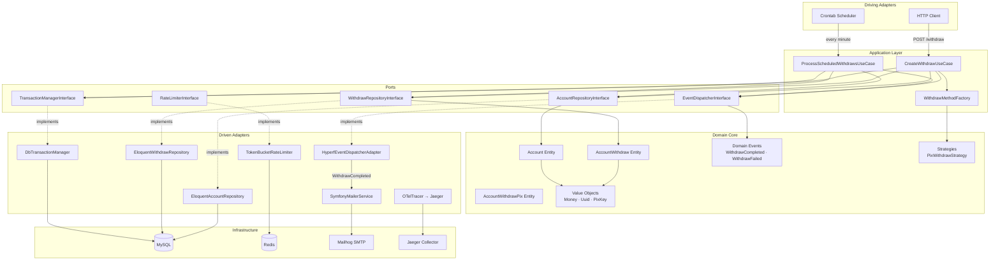
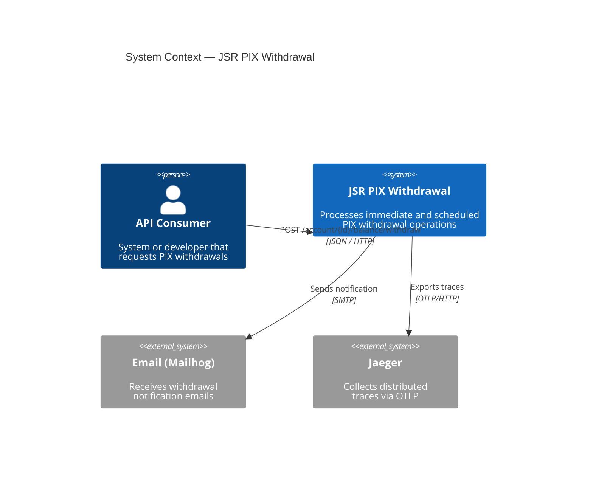
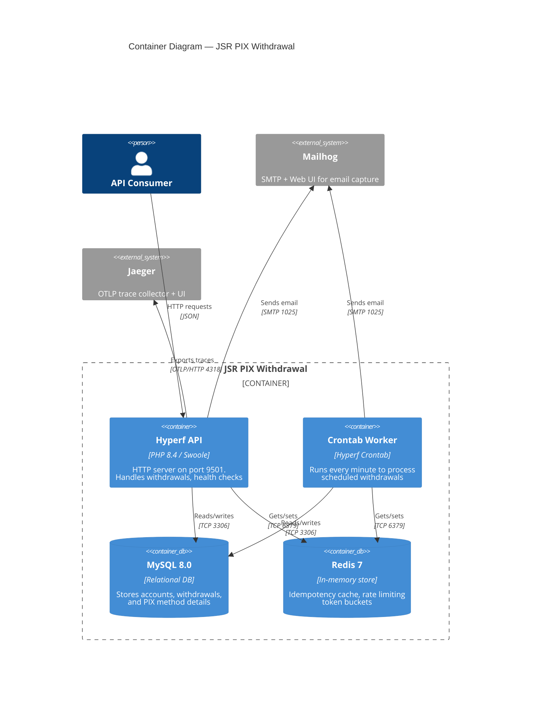
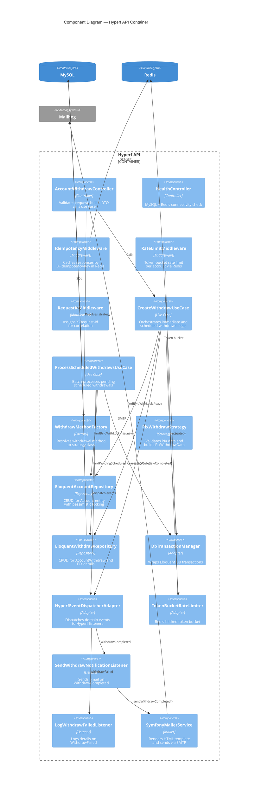
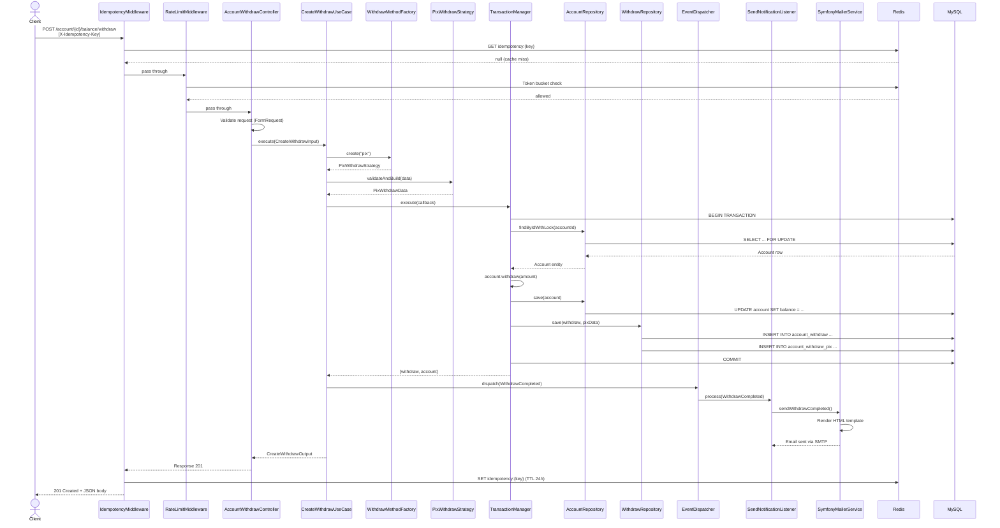
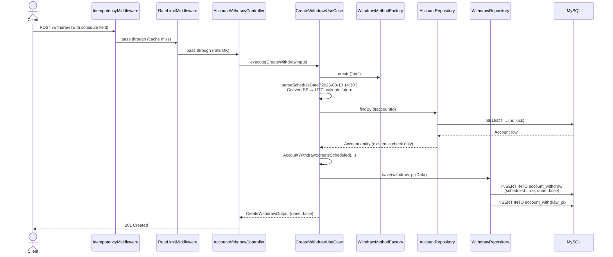
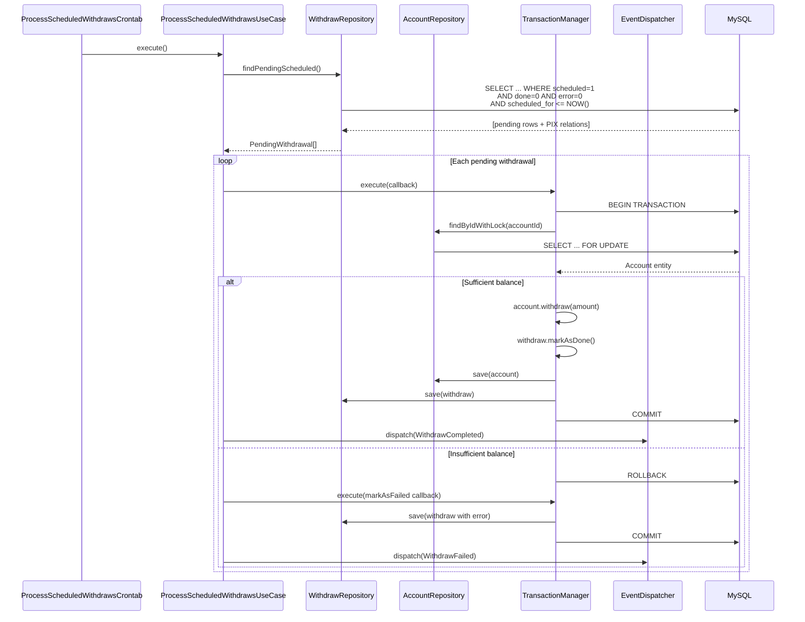
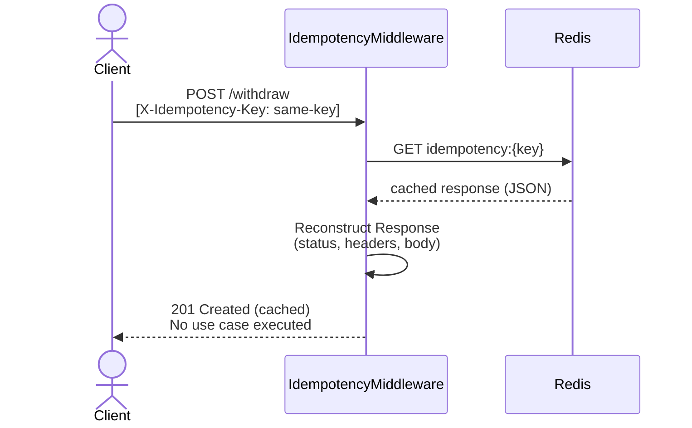
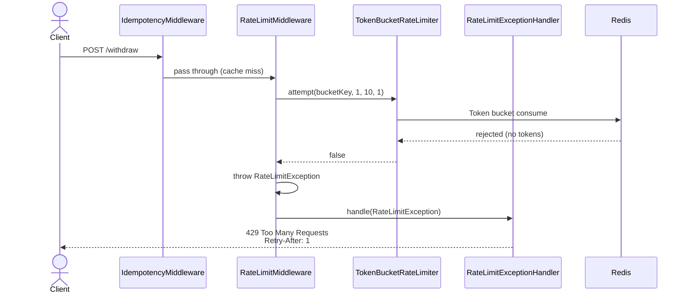

# JSR PIX Withdrawal

A microservice for processing **PIX withdrawal** operations built with the **[Hyperf](https://hyperf.io)** framework (PHP 8.4 + Swoole). It supports immediate and scheduled withdrawals, idempotent requests, per-account rate limiting, email notifications, and distributed tracing via OpenTelemetry/Jaeger.

---

## Table of Contents

- [Architecture Overview](#architecture-overview)
- [Prerequisites](#prerequisites)
- [Quick Start](#quick-start)
- [API Documentation](#api-documentation)
- [Service URLs](#service-urls)
- [Technical Decisions](#technical-decisions)
- [Architecture Diagrams](#architecture-diagrams)
  - [Hexagonal Architecture](#hexagonal-architecture)
  - [Context Diagram (C4 Level 1)](#context-diagram-c4-level-1)
  - [Container Diagram (C4 Level 2)](#container-diagram-c4-level-2)
  - [Component Diagram (C4 Level 3)](#component-diagram-c4-level-3)
  - [Sequence Diagrams](#sequence-diagrams)
  - [Entity-Relationship Diagram](#entity-relationship-diagram)
- [Running Tests](#running-tests)
- [Observability](#observability)
- [License](#license)

---

## Architecture Overview

The service follows **Hexagonal Architecture** (Ports & Adapters), cleanly separating business rules from infrastructure concerns:

| Layer | Folder | Responsibility |
|---|---|---|
| **Controller** | `app/Controller/` | HTTP entry points; validates input, delegates to use cases |
| **Application** | `app/Application/` | Use cases, DTOs and factories that orchestrate domain logic |
| **Domain** | `app/Domain/` | Entities, Value Objects, Enums, Events, Exceptions, Ports (interfaces) and Strategies — **zero framework dependencies** |
| **Infrastructure** | `app/Infrastructure/` | Adapters that implement domain ports — Eloquent repositories, Symfony Mailer, OpenTelemetry tracer, Hyperf event dispatcher, Token-Bucket rate limiter |
| **Middleware** | `app/Middleware/` | Cross-cutting HTTP middleware (idempotency, rate limiting, request ID) |
| **Crontab** | `app/Crontab/` | Scheduled tasks (process pending withdrawals every minute) |

---

## Prerequisites

| Tool | Minimum Version |
|---|---|
| **Docker** | 20.10+ |
| **Docker Compose** | 2.0+ |

> No local PHP, Swoole, MySQL, or Redis installation is required — everything runs inside containers.

---

## Quick Start

### 1. Clone & start the containers

```bash
git clone <repository-url> && cd jsr-pix-withdrawal
docker compose up -d
```

Wait a few seconds for MySQL to be healthy. You can verify with:

```bash
docker compose logs -f app
```

### 2. Install dependencies (first run only)

Dependencies are installed during the image build. If you need to refresh them:

```bash
docker compose exec app composer install
```

### 3. Run database migrations

```bash
docker compose exec app php bin/hyperf.php migrate
```

### 4. Seed test data

Insert a test account with an initial balance:

```bash
docker compose exec app php -r "
    require 'vendor/autoload.php';
    \Hyperf\DbConnection\Db::connection()->insert(
        \"INSERT INTO account (id, name, balance, created_at, updated_at) VALUES (?, ?, ?, NOW(), NOW())\",
        ['11111111-1111-1111-1111-111111111111', 'Test Account', 1000.00]
    );
    echo \"Seed completed.\n\";
"
```

### 5. Verify

```bash
curl -s http://localhost:9501/health | jq
```

Expected response:

```json
{
  "status": "healthy",
  "checks": {
    "mysql": "ok",
    "redis": "ok"
  }
}
```

---

## API Documentation

### `GET /health` — Health Check

Checks MySQL and Redis connectivity.

**Request:**

```bash
curl -s http://localhost:9501/health | jq
```

**Response `200 OK`:**

```json
{
  "status": "healthy",
  "checks": {
    "mysql": "ok",
    "redis": "ok"
  }
}
```

**Response `503 Service Unavailable`:**

```json
{
  "status": "unhealthy",
  "checks": {
    "mysql": "ok",
    "redis": "fail"
  }
}
```

---

### `POST /account/{accountId}/balance/withdraw` — Create Withdrawal

Creates an immediate or scheduled PIX withdrawal. The endpoint applies **idempotency** (via `X-Idempotency-Key` header) and **per-account rate limiting** (token-bucket, 1 token/s, burst of 10).

**Global middlewares applied:** `RequestIdMiddleware`, `TraceMiddleware`, `ValidationMiddleware`
**Route middlewares:** `IdempotencyMiddleware`, `RateLimitMiddleware`

#### Request Headers

| Header | Required | Description |
|---|---|---|
| `Content-Type` | Yes | `application/json` |
| `X-Idempotency-Key` | No | UUID to guarantee idempotent processing (cached 24 h in Redis) |
| `X-Request-Id` | No | Correlation ID; auto-generated if absent |

#### Request Body

| Field | Type | Required | Description |
|---|---|---|---|
| `method` | `string` | Yes | Withdrawal method. Currently: `pix` |
| `pix.type` | `string` | Yes | PIX key type. Currently: `email` |
| `pix.key` | `string` | Yes | PIX key value (valid email) |
| `amount` | `number` | Yes | Withdrawal amount (min: `0.01`, max 2 decimal places) |
| `schedule` | `string` | No | Schedule date in `Y-m-d H:i` (São Paulo timezone). Omit for immediate |

---

#### Example 1 — Immediate Withdrawal

```bash
curl -s -X POST http://localhost:9501/account/11111111-1111-1111-1111-111111111111/balance/withdraw \
  -H "Content-Type: application/json" \
  -H "X-Idempotency-Key: $(uuidgen)" \
  -d '{
    "method": "pix",
    "pix": {
      "type": "email",
      "key": "user@example.com"
    },
    "amount": 150.00
  }' | jq
```

**Response `201 Created`:**

```json
{
  "id": "a1b2c3d4-e5f6-7890-abcd-ef1234567890",
  "account_id": "11111111-1111-1111-1111-111111111111",
  "method": "pix",
  "amount": 150.0,
  "scheduled": false,
  "scheduled_for": null,
  "done": true
}
```

> On success, an email notification is sent to the PIX key address (viewable in [Mailhog](#service-urls)).

---

#### Example 2 — Scheduled Withdrawal

```bash
curl -s -X POST http://localhost:9501/account/11111111-1111-1111-1111-111111111111/balance/withdraw \
  -H "Content-Type: application/json" \
  -H "X-Idempotency-Key: $(uuidgen)" \
  -d '{
    "method": "pix",
    "pix": {
      "type": "email",
      "key": "user@example.com"
    },
    "amount": 50.00,
    "schedule": "2026-03-10 14:30"
  }' | jq
```

**Response `201 Created`:**

```json
{
  "id": "b2c3d4e5-f6a7-8901-bcde-f12345678901",
  "account_id": "11111111-1111-1111-1111-111111111111",
  "method": "pix",
  "amount": 50.0,
  "scheduled": true,
  "scheduled_for": "2026-03-10 14:30:00",
  "done": false
}
```

> The crontab processes scheduled withdrawals every minute once their `scheduled_for` time has passed.

---

#### Example 3 — Idempotent Replay

Sending the same `X-Idempotency-Key` returns the cached response without re-executing the withdrawal:

```bash
IDEMPOTENCY_KEY=$(uuidgen)

# First call — executes
curl -s -X POST http://localhost:9501/account/11111111-1111-1111-1111-111111111111/balance/withdraw \
  -H "Content-Type: application/json" \
  -H "X-Idempotency-Key: $IDEMPOTENCY_KEY" \
  -d '{"method":"pix","pix":{"type":"email","key":"user@example.com"},"amount":10.00}' | jq

# Second call — returns cached response (balance not deducted again)
curl -s -X POST http://localhost:9501/account/11111111-1111-1111-1111-111111111111/balance/withdraw \
  -H "Content-Type: application/json" \
  -H "X-Idempotency-Key: $IDEMPOTENCY_KEY" \
  -d '{"method":"pix","pix":{"type":"email","key":"user@example.com"},"amount":10.00}' | jq
```

---

#### Error Responses

| Status | Code | Scenario |
|---|---|---|
| `400` | `INVALID_UUID` | Invalid account UUID format |
| `400` | `INVALID_WITHDRAW_METHOD` | Unsupported withdrawal method |
| `404` | `ACCOUNT_NOT_FOUND` | Account does not exist |
| `422` | `VALIDATION_ERROR` | Request body fails validation rules |
| `422` | `INSUFFICIENT_BALANCE` | Account balance too low |
| `422` | `INVALID_AMOUNT` | Amount is zero, negative or has >2 decimals |
| `422` | `INVALID_PIX_DATA` | Invalid PIX key type or value |
| `422` | `INVALID_SCHEDULE_DATE` | Schedule date is in the past or wrong format |
| `429` | `RATE_LIMIT_EXCEEDED` | Too many requests (includes `Retry-After` header) |
| `500` | `INTERNAL_ERROR` | Unexpected server error |

**Error response format:**

```json
{
  "code": "INSUFFICIENT_BALANCE",
  "message": "Insufficient balance to complete this withdrawal",
  "details": null
}
```

**Validation error format:**

```json
{
  "code": "VALIDATION_ERROR",
  "message": "The given data was invalid.",
  "details": {
    "pix.key": ["The pix.key field must be a valid email address."]
  }
}
```

---

## Service URLs

| Service | URL | Description |
|---|---|---|
| **API** | [http://localhost:9501](http://localhost:9501) | Hyperf application (Swoole HTTP server) |
| **Mailhog UI** | [http://localhost:8025](http://localhost:8025) | View captured withdrawal notification emails |
| **Jaeger UI** | [http://localhost:16686](http://localhost:16686) | Distributed tracing dashboard |
| **MySQL** | http://localhost:3306 | Database (`hyperf` / `hyperf`) |
| **Redis** | http://localhost:6379 | Cache, rate limiting, idempotency storage |

---

## Technical Decisions

### Why Hexagonal Architecture?

The Domain layer has **zero coupling to Hyperf, Eloquent, or any infrastructure package**. Business rules are expressed through pure PHP: entities with factory methods, value objects with self-validation, and enums. All external dependencies are abstracted behind **port interfaces** (`AccountRepositoryInterface`, `EventDispatcherInterface`, etc.) and wired via Hyperf's DI container in `config/autoload/dependencies.php`. This makes the domain fully testable in isolation and allows swapping infrastructure adapters without touching business logic.

### Why Token-Bucket Rate Limiting per Account?

A token-bucket algorithm (Redis-backed via Hyperf's `RateLimitHandler`) limits each account to **1 token/second with a burst capacity of 10**. This prevents a single account from saturating the service while still allowing short traffic bursts, which is more flexible than a fixed-window counter.

### Why Idempotency Middleware?

Financial operations must be safe to retry. The `IdempotencyMiddleware` caches the full HTTP response (status + headers + body) in Redis for **24 hours** keyed by the `X-Idempotency-Key` header. Replayed requests return the cached response without re-executing the use case, preventing duplicate withdrawals caused by network retries or client-side bugs.

### Why Pessimistic Locking (`SELECT ... FOR UPDATE`)?

Immediate withdrawals deduct the account balance inside a database transaction with `lockForUpdate()`. This ensures that concurrent requests for the same account are serialized at the database level, preventing race conditions that could overdraw an account. The lock scope is narrow (single row, single transaction) to minimize contention.

### Why Domain Events + Listeners?

After a withdrawal completes, a `WithdrawCompleted` event is dispatched. The `SendWithdrawNotificationListener` sends an email notification asynchronously. This decouples the core withdrawal flow from notification delivery — if the mailer is down, the withdrawal still succeeds and the error is logged.

### Why Strategy Pattern for Withdrawal Methods?

The `WithdrawMethodFactory` maps method names to strategy classes (`PixWithdrawStrategy`). Adding a new method (e.g., `TED`) requires only a new strategy class and a factory entry — no changes to the use case or controller.

### Why Symfony Mailer with Mailhog?

Symfony Mailer provides a well-tested, PSR-compatible email abstraction. In development, emails are routed to **Mailhog** (SMTP on port 1025, UI on port 8025) so developers can inspect notifications without configuring a real SMTP server.

### Why OpenTelemetry + Jaeger?

All HTTP requests, database queries, Redis operations, and exceptions are automatically traced via the `TraceMiddleware` and exported to Jaeger through the OTLP HTTP protocol. Each log entry includes `trace_id` and `request_id` via the `TraceContextProcessor`, enabling end-to-end correlation between logs and traces.

### Why Swoole?

Swoole transforms PHP into a persistent, event-driven runtime with coroutine support. This eliminates the traditional PHP request lifecycle overhead (boot → handle → teardown) and enables non-blocking I/O for database, Redis and HTTP calls — resulting in significantly higher throughput and lower latency compared to PHP-FPM.

---

## Architecture Diagrams

### Hexagonal Architecture



---

### Context Diagram (C4 Level 1)



---

### Container Diagram (C4 Level 2)



---

### Component Diagram (C4 Level 3)



---

### Sequence Diagrams

#### Immediate Withdrawal



#### Scheduled Withdrawal (Creation)



#### Crontab — Process Scheduled Withdrawals



#### Idempotency Cache Hit



#### Rate Limit Exceeded



---

### Entity-Relationship Diagram

```mermaid
erDiagram
    account {
        char(36) id PK "UUID v4"
        varchar(255) name
        decimal(15_2) balance "Current balance"
        datetime created_at
        datetime updated_at
    }

    account_withdraw {
        char(36) id PK "UUID v4"
        char(36) account_id FK "→ account.id"
        varchar(20) method "e.g. pix"
        decimal(15_2) amount
        boolean scheduled "false = immediate"
        datetime scheduled_for "NULL if immediate"
        boolean done "true when processed"
        boolean error "true on failure"
        varchar(255) error_reason "NULL if no error"
        datetime created_at
        datetime updated_at
    }

    account_withdraw_pix {
        char(36) account_withdraw_id PK_FK "→ account_withdraw.id"
        varchar(20) type "e.g. email"
        varchar(255) key "PIX key value"
    }

    account ||--o{ account_withdraw : "has many"
    account_withdraw ||--o| account_withdraw_pix : "has one (if method=pix)"
```

---

## Running Tests

```bash
# All tests
docker compose exec app composer test

# Specific test file
docker compose exec app vendor/bin/co-phpunit --prepend test/bootstrap.php test/Unit/Application/UseCase/CreateWithdrawUseCaseTest.php

# Static analysis
docker compose exec app composer analyse
```

---

## Observability

### Structured Logging

All logs are JSON-formatted to `stdout` and include `request_id` and `trace_id` for correlation:

```json
{
  "message": "Withdraw completed",
  "context": { "withdraw_id": "...", "account_id": "...", "done": true },
  "extra": { "request_id": "abc-123", "trace_id": "def-456" }
}
```

### Distributed Tracing

Browse traces in the [Jaeger UI](http://localhost:16686). Traced operations include:
- HTTP requests (full lifecycle)
- MySQL queries
- Redis commands
- Exceptions

### Email Notifications

Browse captured emails in the [Mailhog UI](http://localhost:8025).

---

## License

[Apache-2.0](LICENSE)
